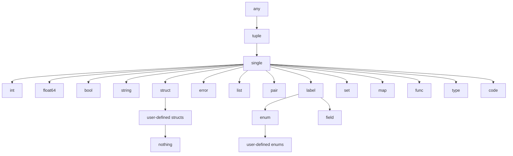

# Charm

## What is Charm and why?

While Charm is a general-purpose language, it was particularly created to implement new ideas about how people could more ergonomically create, manage, and use CRUD apps. It is a work in progress, not yet ready for use in production, and is presented here for discussion, criticism, and the minor thrill of seeing stars accumulate on the repository.

The principal purpose of this README file is to teach people how to use the language, assuming a certain amount of experience in using other programming languages, and in the terminology used to describe them.

If you want to use the language rather than just learn about it, you should also read at least the first two parts of the document on (The Charm hub)[https://github.com/tim-hardcastle/Charm/blob/main/docs/the-charm-hub.md], which explains how to use Charm's text-based shell to start and stop services, debug, write tests, and other things useful to developers.

For a high-level view of the aims of the language and the principles of its design, with particular emphasis on the features that make it novel and suited to its use-case, see [this document](https://github.com/tim-hardcastle/Charm/blob/main/docs/charm-a-high-level-view.md), which explains such things in depth. Another supplementary document, [*The whys of Charm*](https://github.com/tim-hardcastle/Charm/blob/main/docs/the-whys-of-charm.md), explains specific decisions about syntax and semantics which may seem in need of explanation: this README will occasionally link to that document in footnotes.

## Features

Features already implemented include:

- Functions with optionally typed parameters and return values
- Overloading of pretty much everything including arithmetic operators
- Multiple dispatch.
- First-class functions, lambdas, closures, inner functions.
- Streaming operators
- First-class types including int, string, bool, float, list, tuple, pair, map, structs, enumerated types, error, type, func, and label.
- Variables static by default, dynamic by request
- Transactions
- Encapsulation
- Serialization and eval
- Reflection
- Comparison by value
- Imports
- A growing number of standard libraries including math, strings, and fmt
- Throwing and handling errors
- Embeddable Go
- Macros
- Interactive error messages and trace
- Logging
- A helpful way of writing tests from the REPL
- A Functional Core / Imperative Shell architecture[^fcis]
- Turns into a server on demand
- Microservices
- Role-based access management
- Syntax highlighting

[^fcis]: See [Functional core / imperative shell](https://github.com/tim-hardcastle/Charm/blob/main/docs/functional-core-imperative-shell.md) for an explanation of the paradigm and how Charm implements it.

## Getting started

### Setup

You will need a recent version of Go installed to build the interpreter.

To use the VS Code syntax highlighter, move the `charm-highlighter` folder of the distribution to your `<user home>/.vscode/extensions` folder and, if VS Code is already running, restart it.

Having one way or another obtained a working executable, run it with `./charm` in the root directory. You should see something like this:

```
  ╔══════════♥══════════╗
  ║ Charm version 0.3.5 ║
  ╚══════════♥══════════╝

→  
```

### The REPL

You're now using Charm's REPL, its Read-Evaluate-Print Loop. If you enter something for it to evaluate, like `2 + 2`, it will evaluate it for you.

```
→ 2 + 2
4 
→ 
```

### "Hello world!"

It is usual when introducing a programming language to give, as the first example, a piece of code which on start-up prints the words `Hello world!` and then turns itself off.

It is possible to do this in Charm, but this is such an un-Charmlike thing to do that the full capability wasn't introduced until version 0.3.10. Here is the source code.

```
cmd

main :
    respond "Hello world!"
    stop
```

Before we get around to writing some more normal-looking Charm scripts, let's use the REPL to explore some of the basic features of the language.

## Standard types

First, let's look at some of the standard data types, their literals, and the supplied built-in operations.

### `int`

The `int` type contains whole numbers which may be either positive or negative.

Integer literals are as you'd expect: `36`, `0`, `-17`, etc. Besides these there are representations of integers in binary (e.g `0b10011` represents the number 19) octal (`0o23` represents 19) and hex (`0x13` represents 19.)

Operations on integers are `+`, `-`, `*`, `/`, and `%`. The first three of these require no explanation. 

The `/` operation when applied to integers returns a whole number, e.g. `5 / 2` evaluates to `2`.

The `%` is a remainder operator, e.g. `5 % 2` is `1`. Note that it will return negative results for negative operands, e.g. `-5 % 2` evaluates to `-1`.

The underlying size of the integer is platform-dependent, according to whether you have a 32-bit or 64-bit machine.

### `float64`

The `float64` type contains decimal numbers: `6.5`, `-9.33`, `3.141592`, etc.

Its operations are `+`, `-`, `*` and `/`, all of which work as you expect.

```
→ 2.5 / 0.25                                                                                                
10.000000
→ 
```

Mixing the arithmetic of integers and floating-point numbers will result in an error. We will see how to avoid this in the section on type conversion.

### `bool`

The `bool` type consists of the boolean constants `true` and `false`. Its operations are `and`, `or`, and `not`:

```
→ not false 
true
→ true or false 
true
→ true and false 
false      
→    
```

`and` and `or` are lazily evaluated. So, for example `false and 1 / 0` will return `false` rather than a division by zero error.

The boolean valued relations `<`, `>`, `<=` and `>=` work as you would expect them to from math class. `==` is used for equality and `!=` for inequality.

```
→ 2 + 2 == 4
true
→ 3 + 3 != 6
false
→ 
```

There is also a conditional operator, as in the following example.

```
→ 2 + 2 == 3 : "Oops"; 2 + 2 == 4 : "Whew!"; else : "Who even knows?"
Whew!
→
```

We will have a lot more to say about this [later](#more-about-conditionals).

### `string`

A `string` is a sequence of "runes": letters, numbers, or anything else that your computer can use as a symbol.

There are two kinds of string literals. Double quotes, `"like this"`, represent escaped strings with the following escape codes:

| Sequence | Description |
| --- | --- |
| `\\` | Backslash |
| `\t` | Horizontal tab |
| `\n` | Line feed or newline |
| `\r` | Carriage return |
| `\"` | Double quote |

But if we use `` `strings with backticks` `` then these sequences are unescaped. To see the difference:

```
→ "Hello world!\nWhat a nice day!" 
Hello world!
What a nice day!
→ `Hello world!\nWhat a nice day!` 
Hello world!\nWhat a nice day!
→    
```

Strings can be added together with the `+` operator:

```
→ "mac" + "hine" 
machine
→ 
```

The `len` function returns the length of a string:

```
→ len "Charm" 
5   
→ 
```

The runes in a string can be indexed, starting at `0`: i.e.:

```
→ "Charm"[0]      
C
→ "Charm"[4]      
m
→ 
```

A "slice" can be taken out of a string like this:

```
→ "Charm"[1::4]      
"har"
→ 
```

Note that the slice is from-including up-to-and-not-including, as is everything else in Charm.

## Variables

So far, this has been much like (for example) the Python REPL. However, one important difference is that variables must be created from a script, rather than from the REPL. Let's write our first Charm script.

```
var

h = "Hello world!"
x = 2 + 2
```

This will be found in the example code of the distribution under `examples/variables.ch`, and can be run like this:

```
→ hub run "examples/variables.ch"
Starting script 'examples/variables.ch' as service '#0'.
#0 →
```

You're now running the script. Apparently nothing has happened, but you now have a couple of variables to play with:

```
#0 → h 
Hello world!
#0 → x      
4
#0 → x = 3 * 2 
ok
#0 → x 
6
#0 → 
```

Let's talk about what's happening here. The "hub", the housekeeping part of Charm (see [here](https://github.com/tim-hardcastle/Charm/blob/main/docs/the-charm-hub.md) for more information), has run the script and given the resulting service the name `#0`, since we didn't name it ourselves. Running the script has created the variables and intitialized them. We can then access them through the REPL, or, to be pedantic, through the REPL of service `#0`.

This is how a Charm service generally works. Charm is a REPL-oriented language: a Charm script doesn't necessarily have to *do* anything. It *can*, as in the `Hello world!` example above, but it doesn't have to and it is anticipated that for many normal uses of the language it won't. Rather, the script permits the end-user to do things in the REPL: in this case allowing them to access and set the variables `x` and `h`.

You will note from the example above that it is perfectly valid to initialize a variable with an expression, in this case `2 + 2`.

## Comments and continuations

These are illustrated by the example file `examples/com&con.ch`, given in full below.

```
var

// This is a comment.

// And below, the two types of continuation.

x = "hello " + ..
 .. "world"

y = 1, 2, 3,
 .. 4, 5, 6
```

Comments are very much what you’re used to from other languages. Continuations must be marked by a `..` at the end of the continued line and a corresponding `..` at the beginning. The allowed exception is that the continued line may end in a comma *where this is syntactic*, in which case the continuation must begin with `..` just the same. The continuations can be placed wherever is most readable: they are exempt from whitespace rules.


## Compound types

### `list`

The `list` type consists of an ordered, indexable, nestable collection of objects. List literals consist of the elements of the list separated by commas and enclosed in square brackets, e.g. `["a", "b", "c", "d"]` or `[42, true, "bananas"]`, or, since lists can contain lists, `[1, [2, 3], 4]`. An empty list is denoted by `[]`.

A list, like a string, can be indexed and sliced using the same notation, and as with strings the `len` function will return its length. Also, the `in` operator will evaluate whether an element is in a list.

```
#0 → ["a", "b", "c", "d"][1]
b
#0 → ["a", "b", "c", "d"][1::3] 
[b, c]
#0 → len ["a", "b", "c", "d"] 
4
#0 → "a" in ["a", "b", "c", "d"] 
true 
#0 →
```

Also, like strings, lists can be added together:

```
#0 → ["a", "b"] + ["c", "d"]
[a, b, c, d]
#0 → 
```

### `set`

The `set` type is an unordered, unindexed collection of objects: `{1, 2, 3}` or `{42, "walrus"}`. The empty set is denoted by `{}`.

Since `set` is unordered, it cannot be indexed or sliced. `len` and `in` work as for lists, as does addition:

```
#0 → 1 in {1, 2, 3} 
true
#0 → {1, 2, 3} + {4} 
{1, 2, 3, 4}
#0 → len {1, 2, 3}
3
#0 → 
```

### `pair`

The `pair` type is formed using the `::` infix, e.g. `42 :: "foo"`, or `walrus :: true`.

Unlike in some other languages, it is not intended that you use this to construct list-like structures out of it[^pair]. You *could*, but you already have a `list` type which is better. Rather, the `pair` type is intended to represent things that naturally come in pairs, in particular key-value pairs in maps and field-value pairs in structs.

You will notice it is also used to supply a pair of integers as the parameter of the slice operator for lists and strings.

Besides the `::` operator that creates it, the only operation defined on a pair is indexing, the left element having index `0` and the right element having index `1`.

[^pair]: See [The whys of Charm: Why does the pair type exist?](https://github.com/tim-hardcastle/Charm/blob/main/docs/the-whys-of-charm.md#why-does-the-pair-type-exist).

### `tuple`

The `tuple` type is an ordered, indexable, unnestable[^tuple] collection of objects. It is represented by a comma-separated sequence of objects, e.g. `1, 2, 3`, which may optionally be enclosed in parentheses: `(1, 2, 3)`. The empty tuple is represented by `()`; for clarity you may with to write `tuple ()`.

By "unnestable", we mean that for example `((1, (2, 3)), ((4)))` is the same as `1, 2, 3, 4`. 

The `+` operator is not implemented for the `tuple` type, since the fact that they are unnestable means that they can be concatenated simply with commas.

The `tuple` type does not have a `len` function: it has an `arity` function. To see why, consider the following:

```
#0 → arity "bananas", "grapes"
2
#0 → arity "bananas"
1
#0 → len "bananas"
7
#0 → 
```

The index and slice operators work for tuples. However, there is only one case where this is idiomatic. The essential purpose of the `tuple` type is to pass multiple values to [functions](#functions) and to get multiple values back. Indexing and slicing tuples should be done when (as will often be the case in functional programming) you wish to keep only some of the return values of a function, and discard others.

As with all languages that implement tuples, this type is the Cinderella of the type system. If you find yourself using it for reasons other than those given above, you should ask yourself why and then use a list instead.

[^tuple]: See [The whys of Charm: Why are tuples flat?](https://github.com/tim-hardcastle/Charm/blob/main/docs/the-whys-of-charm.md#why-are-tuples-flat).

### `map`

A map is a collection of key-value pairs which can be indexed by the keys. Its literals are formed by `map` followed by a tuple of key-value pairs, e.g: `map "foo" :: "bar", 42 :: "walrus"`.

Indexing is done as usual with square brackets:

```
#0 → (map "foo" :: "bar", 42 :: "walrus")[42]
walrus
#0 → 
```

The `len` function will return the number of keys in the map. The slice operator is not supported, because what would it do?

An error will be returned if the key is not in the map:

```
#0 → (map "foo" :: "bar", 42 :: "walrus")["zort"]    
[0] Runtime error: object '"zort"' is not in the keys of map at line 1:36 of REPL
input.
#0 → 
```
## Headwords

In our example (`examples/variables.ch`) of creating variables, you will notice that the declarations were preceeded by the word `var`. This is a *headword*, meaning, in this case, "please treat everything that follows this as a variable declaration until either the end of the script, or until you reach another headword".

The other headwords are `import`, `cmd`, and `def`. Headwords can be used in any order and as many times as you like, except for `import` which can occur at most once, at the top. (So when I refer to “the def section” etc in what follows I am not necessarily talking about one continuous piece of the script, but rather about everything in it which has `def` as its headword.)

In the def section we define constants, functions, and user-defined types. (In a script of any length, this will be 99% of the code.) Let's look at constants first.

## Constants

In the example file `examples/constants.ch` we define two variables and a constant:

```
var

radius = 10.0
circumference = 2.0 * PI * radius

def

PI = 3.141592
```

If we try it out ...

```
#0 → hub run "examples/constants.ch"
Starting script 'examples/constants.ch' as service '#1'.
#1 → PI     
3.141592
#1 → PI = 4 

[0] Error: attempt to update a constant 'PI' at line 1 of REPL input.

#1 → circumference 
62.831840
#1 → 
```

You will notice that the order of declaration is free: `examples/constants.ch` declares `PI` after `circumference`: the initializer copes.

## Functions

### Introducing functions

Functions are pure and stateless and so the only thing they can do is specify return values. (For this reason, Charm functions have no `return` statement, since the whole body of the function is just one single expression saying what to return.) The basics are demonstrated in `examples/functions.ch`. Here’s the code:

```
def

twice(x string) : x + x

twice(x int) : 2 * x

twice(b bool) :
    b : "That's as true as things get!"
    else : "That's as false as things get!"

twice(x any) :
    "Can't double " + string (type x) + "."

swap(x, y) : y, x

sign(n) :
    n > 0 : "positive"
    n == 0 : "zero"
    else : "negative"

(x) squared : x * x

(x) times (y) : x * y

(x) divides (y) :
    y % x == 0

(x) is even:
    2 divides x

say (x) nicely :
    "*~*" + x + "*~*"

gcd (x, y) :
    x < y : gcd(y, x)
    y divides x : y
    else : gcd(y, x % y)
```

And it all does what you’d think it would do:

```
#1 → hub run "examples/functions.ch"                                                                                
Starting script 'examples/functions.ch' as service '#2'.
#2 → twice 2                                                                                                         
4
#2 → twice true                                                                                                      
That's as true as things get!
#2 → say "hello" nicely                                                                                              
*~*hello*~*
#2 → 5 squared                                                                                                       
25
#2 → 5 is even                                                                                                       
false
#2 → sign 5                                                                                                          
positive
#2 →  
```

Charm uses syntactic whitespace[^whitespace], as you can see in the functions with multiline bodies. As in many other syntactic whitespace languages, the newline is syntactic sugar for a semicolon (or vice versa). And indents and outdents are sugar for left and right parentheses. So:

```
sign(n) :
    n > 0 : "positive"
    n == 0 : "zero"
    else : "negative"
```

... is just a nicer way of writing the [conditional syntax](#bool) we met earlier:

```
sign(n) : (n > 0 : "positive"; n == 0 : "zero"; else : "negative")
```

We’ll look more at conditionals and their syntax [later](#more-about-conditionals).

As you can see from the examples, it isn't necessary to give types to the parameters of the functions. If you don't, they will accept any type, as exemplified by the `swap` function, above. However, if you *do*, then you can overload the functions, defining the same function differently for different parameter types, as with the `twice` function in the example. We will look at overloading in more detail [later](#overloading).

Some minor points to note about the syntax: (1) The parentheses around the parameters are obligatory in the declaration but optional when calling (except as needed to indicate precedence). (2) You are allowed to write a one-line expression after the `:` if you want to, rather than indenting it and putting it on a separate line.

[^whitespace]: See [The whys of Charm: Why the syntactic whitespace?](https://github.com/tim-hardcastle/Charm/blob/main/docs/the-whys-of-charm.md#why-the-syntactic-whitespace)

### Return types

Function can optionally be given return types. A small example is given in `examples/returntypes.ch`:

```
def

add(x, y) -> int : x + y

swap(x, y) -> string, bool : y, x
```

### Precedence

Infix and suffix functions bind rather tightly to their parameters. E.g if you have an infix operator `moo` then `1, 2 moo 3, 4` parses as `1, (2 moo 3), 4`; if you have a suffix operator foo then `1, 2 foo` parses as `1, (2 foo)`.

You can give such functions more parameters than two and one respectively, but you would have to use parentheses to indicate this when calling, e.g. if you have a function `(x, y) foo : x + y` then you would call this on values `a, b` by saying `(a, b) foo`. If instead you wrote `a, b foo`, then the only thing this could mean that would be both syntactic and semantic would be “the tuple consisting of whatever `a` is, followed by whatever `foo` applied to `b` is, and if `b` isn’t a tuple of arity 2 there’s going to be a runtime error.”

However, regular functions with their parameters to the right try to slurp up pretty much everything to the right of them: the following gives an error because all three numbers are passed as parameters:

```
#2 → gcd 26, 65, 3                                                                                                   
Error: 'gcd' doesn't have any suitable type signature to interpret that at line 1 of REPL input.
#2 →       
```

If what you mean is `gcd(26, 65), 3`, then you can write that, or you can write `(gcd 26, 65), 3`.

The logical operators `or` and `and`, however, have lower precedence than functions/operators, i.e. `foo zort and bar` parses as `(foo zort) and bar`.

### Lambdas and closures

We can make anonymous functions using the `func` keyword:

```
var

add = func(x, y) :
    x + y

g = addN(5)

def

addN (n) :             //  Look, a closure!
    func(x) : x + n

apply (f) to (x tuple) :
    f x

apply (f) twice to (x tuple) :
    f f x

while (p) do (f) to (x tuple) :
    p x : while p do f to f x
    else : x

condition = func (x, y) : x > 0
action = func (x, y) : x - 1, y * 2
```

Let’s give it a spin in the REPL.

```
#2 → hub run "examples/lambdas.ch"                                                                                        
Starting script 'examples/lambdas.ch' as service '#3'.
#3 → add 7, 3                                                                                                           
10
#3 → g 3                                                                                                                
8
#3 → apply g twice to 3                                                                                                 
13
#3 → while condition do action to 7, 1                                                                                  
0, 128
#3 →         
```

Fans of functional programming idioms will realize that what that last one needs to make it work properly are local constants. Let’s have some.

### Local constants and inner functions

These are defined in the `given` section of a function[^given], as demonstrated in `examples/given.ch`:

[^given]: See [The whys of Charm: why the `given` section](https://github.com/tim-hardcastle/Charm/blob/main/docs/the-whys-of-charm.md#why-the-given-section)

```
def

g (x) : a * b * x
given :
    a = x + 1
    b = x + 2

// Now let's use that 'while' function properly.

while (p) do (f) to (x tuple) :
    p x : while p do f to f x
    else : x

power (x) :
    (while condition do action to x, 1)[1]
given :
    condition(x, y) : x > 0
    action(x, y) : x - 1, y * 2

// Inner functions can have their own 'given' blocks,
// as can lambdas.

var

f = func (x) : a * b(x)
given :
    a = x + 1
    b(x) : x + c(x)
    given :
            c = func(x): m * x
            given m = 5
```

Note that an inner function is syntactic sugar for a lambda. So it must have a vanilla `<function name> (<parameters>) syntax`, it cannot be overloaded, and it can be passed.

### this

Functions can refer to themselves as `this`. This isn’t just syntactic sugar: there isn’t any other way for a lambda to refer to itself, since they have no names. The file `examples/this.ch` has an example.

```
def

max (L list):
    len(L) == 0 : error "taking the max of an empty list"
    else : maxer(1 , L[0])
given :
    maxer = func(i int, m int) :
            i < len(L) : this i + 1, max(m, L[i])
            else : m

max (x, y int) :
    x > y : x
    else : y
```

## More about conditionals

The file `examples/conditionals.ch` shows some more things you can do with conditionals.

```
def

// Conditionals nest more comprehesibly with whitespace.

classify (i int) :
    i > 0 :
            i < 10 : "small number"
            else : "big number"
    i == 0 : "zero"
    else :
            i > -10 : "small negative number"
            else: "big negative number"

// An incomplete conditional.

incomplete(i) :
    i > 0 :
            i < 10 : "small number"

// And a use for one.

objectToZero(x) :
    x == 0 : "Zeros are bad! Bad!"

(x) divides (y) :
    objectToZero(x)
    else : y % x == 0
```

The `classify` function does what you think it will.

```
#3 → hub run "examples/conditionals.ch"
Starting script 'examples/conditionals.ch' as service '#4'.
#4 → classify 100
big number
#4 → classify -5 
small negative number
#4 → 
```

The `incomplete` function will throw an error for numbers not captured by its conditions, and so is bad. Normally you should `else` all your conditionals to stop this from happening:

```
#4 → incomplete 5                                                                                                    
small number
#4 → incomplete 100                 

[0] Runtime error: unsatisfied conditional at line 1 of REPL input.

#4 → 
```

But note the `objectToZero` function and its use. Charm always needs a conditional to evaluate to something *in the end*. But this doesn’t need this to happen all in one function. The last two functions demonstrate what I mean more quickly than I could explain it. If `objectToZero` finds its conditional unsatisfied, it would return an error to the end user, but it merely reports its unsatisfied state and not an unsatisfied conditional error to `divides`, or generally to any calling function. If it is returned in a context where an unsatisfied conditional makes sense (i.e. during the evaluation of a conditional expression) then this is not an error:

```
#3 → 2 divides 4  
true
#3 → 0 divides 4   
Zeros are bad! Bad!
#3 → objectToZero 0    
Zeros are bad! Bad!
#3 → objectToZero 2 
  
[0] Runtime error: unsatisfied conditional at line 1 of REPL input.

#3 → 
```

## Logging / instrumentation

One of the problems with pure functions is seeing what's going on inside them. Fortunately it's only the tiniest blemish on the purity of our functions if we do just that. Logging/instumentation markup is provided by the `\\` operator, as demostrated in `examples/logging.ch`:

### Basic logging

```
def
    
foo(x, y) :                  \\ "Called with parameters", x, y
    x % 2 == 0:              \\ "Testing if x is even."
        x                    \\ "x is even. Returning", x
    else :                   \\ "Else branch taken"
        3 * y                \\ "Returning", 3 * y
    
zort(x, y) :                 \\ 
    x % 2 == 0 and y > 7:    \\ 
        x                    \\ 
    else :                   \\
        x < y : 42           \\
        else : x + y         \\ 
```

Run it in the REPL ...

```
→ hub run "examples/logging.ch"     
Starting script 'examples/logging.ch' as service '#0'.
#0 → foo 1, 2   
Log at line 6:
    Called with parameters x = 1; y = 2
    
Log at line 7:
    Testing if x is even. 
    
Log at line 9:
    Else branch taken 
    
Log at line 10:
    Returning (3 * y) = 6
    
6  
#0 →
```

Note that a log statement is executed if the line it is adjoined to is executed. In particular, in a line of the form `<condition> : <return value> \\ <log statement>`, the logging will take place whether or not the condition is met. If you want to avoid that, then you can of course write:

```
<condition> :
    <return value> \\ <log statement>
```

It is a syntax error to adjoin a logging statement to a line saying only `given :` because there is no meaningful interpretation of what that should do. Logging statements attached to inner functions will execute when they are called as with normal functions.

### Autologging

The sort of things you might want to log at each line could be inferred for you, so if you leave the logging statement empty, as in the function `zort`, Charm will take a stab at doing that:

```
#0 → zort 2, 2 
Log at line 12:
    Function called.
    
Log at line 13:
    (x % 2) is 0, but y is 2, so the condition fails.
    
Log at line 15:
    The 'else' branch is taken.
    
Log at line 16:
    x and y are both 2, so the condition fails.
    
Log at line 17:
    The 'else' branch is taken. Returning (x + y) = 4.
    
4  
#0 →   
```

The logging can be tweaked by setting [service variables](#service-variables):

```
#0 → $logTime = true                                                                                                                          
ok 
#0 → $logPath = "./rsc/test.log" 
ok
#0 → zort 3, 5 
42
#0 → os cat ./rsc/test.log 
Log at line 12 @ 2022-12-19 05:02:46.134767 -0800 PST:
    Function called.
    
Log at line 13 @ 2022-12-19 05:02:46.13737 -0800 PST:
    (x % 2) is 1, so the condition fails.
    
Log at line 15 @ 2022-12-19 05:02:46.137498 -0800 PST:
    The 'else' branch is taken.
    
Log at line 16 @ 2022-12-19 05:02:46.137561 -0800 PST:
    x is 3 and y is 5, so the condition is met. Returning 42.
    
#0 →
```

### Conditional logging

It is desirable to be able to turn logging on and off. A log statement of the form `\\ <condition> : <logging statement>` won't log anything if the condition isn't met. For example:

```
def

log = true
simonSaysLog = true

classify(n):
    n == 0 :
        "n is zero"                 \\ log : "Zero branch"
    n > 0 :
        n < 10 : "n is small"       \\ log or simonSaysLog : "Positive branch"
        n > 100 : "n is large"
        else : "n is medium"
    else:
        "n is negative"             \\ log : "Negative branch"
```

## Streaming operators

There are three streaiming operators, pipe `->`, map `>>` and filter `?>`. 

Each operator implicitly defines a very local constant called `that`. Let's demonstrate it in the REPL:

```
#3 → 2 -> that + 1 -> 5 * that                                        
15
#3 → [1, 2, 3, 4, 5, 6] >> 2 * that
[2, 4, 6, 8, 10, 12]
#3 → [1, 2, 3, 4, 5, 6] ?> that % 2 == 1                              
[1, 3, 5]
#3 → [1, 2, 3, 4, 5, 6] ?> that % 2 == 1 >> that * that 
[1, 9, 25]
#3 → 2 -> that + 1
3
#3 → 
```

As a piece of syntactic sugar, when the right-hand side of a streaming operator consists only of the name of a function (or variable containing a lambda) then the left-hand side is fed to the function without the necessity of specifying `that` as its argument:

```
#3 → "Hello" -> len                                                   
5
#3 → ["The", "walrus", "and", "the", "carpenter"] >> len 
[3, 6, 3, 3, 9]
→  
```

The use of meaningfully-named inner functions can make for very readable code, as demonstrated in `exampes/streaming.ch`:

```
def

squaresOfOddNumbers(L):
    L ?> isOdd >> squared
given:
    isOdd(x) : x % 2 == 1
    squared(x) : x * x
```

## `import`

The `import` section has to come at the top of the script, if there is an import section at all. It consists of filepaths expressed as string constants and separated by newlines:

```
import

"lib/foo.ch"
"lib/bar.ch"
```

The functions in the imported files will automatically be namespaced, i.e. a function `zort` in `lib/foo.ch` will be called `foo.zort` once imported. To change the namespace, use the pair operator:

```
import

"lib/foo.ch" :: "oof"
"lib/bar.ch"
```

Now `zort` will be called `oof.zort` when imported. Using the empty string as a namespace will mean that the functions aren't namespaced at all.

An example is given in `examples/import.ch`, which imports `lib/complex.ch`, which is a tiny library to overload the `+` and `* `operators to let you treat pairs as complex numbers. Here’s the main script:

```
import

"lib/complex.ch" :: ""

def

mandelbrot(c pair) :
    mandeler(0, (0.0 :: 0.0))
given :
    mandeler = func(i int, z pair) :
        i > 50 : true
        z[0] * z[0] + z[1] * z[1] > 4.0 : false
        else : this(i + 1, z squared + c)
```

And the library:

```
def

(c1 pair) + (c2 pair) : c1[0] + c2[0] :: c1[1] + c2[1]

(c1 pair) * (c2 pair) : c1[0] * c2[0] - c1[1] * c2[1] ..
                  .. :: c1[0] * c2[1] + c1[1] * c2[0]

(c pair) squared : c * c
```

Most of the other libraries supplied wrap around Go functions rather than native Charm: such functions will be discussed in a later section.


## Recursion

Functional programming has a reputation of requiring recursive functions (as in the previous example), which sometimes alarms people. In fact, except in cases where you’d reach for recursion in any other language, you really only need one recursive function, it’s very short, and I’ve already written it for you: it’s in `examples/recursion.ch`:

```
def

// You only really need this one:       

while (p) do (f) to (x tuple) :
    p x : while p do f to f x
    else : x

// But we can make other general-purpose recursive functions ...

for (n) do (f) to (x tuple) :
    (while unfinished do loop to 0, x)[1::count(x) + 1]
given :
    unfinished(i int, x tuple) : i < n
    loop(i int, x tuple) : i + 1, f x

// And all the nasty recursion disappears ...

power2 (n int) : for n do action to 1
given : action = func(x) : 2 * x

stars (n int) : for n do action to ""
given :
	action(x) : x + "*"

// Let’s make that max function shorter

max(L list) : (while condition do action to 1, L[0])[1]
given :
    condition(i, m) : i < len(L)
    action (i, m) : i + 1, max(m, L[i])

max (x, y int) :
    x > y : x
    else : y
```

A quick look at the REPL to see this working:

```
#4 → hub run "examples/recursion.ch"                                                                                    
Starting script 'examples/recursion.ch' as service '#5'.
#5 → stars 5                                                            
*****
#5 → power2 8                                                            
256
#5 → max [72, 35, 84, 16]                                                
84
#5 → 
```

And so on.

Obviously such standard functions for doing generalized recursion should be contained in a standard library, the *prelude* as it’s called in Haskell.

To demonstrate the principle, a small prelude has been supplied in `lib/prelude.ch`, including `while`, `for`, and `mergesort`.

More functions like this will be provided when I’ve decided what they should be, and what they should look like.

## `struct`

This type is demonstrated in the file `examples/structs.ch`:

```
def

person = struct(name string, age int)

cat = struct(name string, nobelPrizes int, pink bool)

catDefaults = nobelPrizes :: 0, pink :: false

var

doug = person "Douglas", 42

joe = person with name :: "Joseph", age :: 22

tom = person with age :: 49, name :: "Thomas"

myCat = cat with name :: "Felix", catDefaults

me = catOwner("Tim", myCat)

myField = name
```

Let’s give this a spin in the REPL:

```
#5 → hub run "examples/struct.ch"                                                                                            
Starting script 'examples/struct.ch' as service '#6'.
#6 → doug                                                                                                               
(name :: Douglas, age :: 42)
#6 → joe[name]                                      
Joseph
#6 → tom[age]                                                                                                          
49
#6 → doug == person with name :: "Douglas", age :: 42                                                                 
true
#6 → myCat                                                                                                              
name :: Felix, nobelPrizes :: 0, pink :: false
#6 → myCat = cat with name :: "Tibbles", catDefaults                                                                  
ok
#4 → myCat                                                                                                              
(name :: Tibbles, nobelPrizes :: 0, pink :: false)
#6 → myCat[myField]                                                                                                   
Tibbles
#6 → doug[myField]                                                                                                      
Douglas
#6 → 
```

Some things to note:

(1) Structs are indexed like maps, with square brackets, because a struct is very like a little opinionated map.

(2) `struct` types are declared by `nameOfStruct = struct(<type signature of construtor>)`. 

(3) There is also a long-form constructor using the word `with` and a tuple of label-value pairs.

(4) The labels of the fields are first-class objects, of type `field`.

(5) Field-value pairs are also first-class objects.

(6) Comparison is as always by value.

## `with`

We’ve just seen one use of `with`, as a constructor, where it takes a subtype of `struct` as its first argument. The other is as a modifier, returning an altered copy of the structure, or a map, or a list.

For example:

```
#6 → doug with age :: 43
(name :: Douglas, age :: 43)
#6 → 
```

This does not change the value of `doug`.

```
#6 → doug
(name :: Douglas, age :: 42)   
#6 →   
```

The desired changes can be concatenated with commas:

```
#6 → myCat with name :: "Harold", pink :: true       
(name :: Harold, nobelPrizes :: 0, pink :: true)  
#6 → 
```

However, the same effect can be achieved by using several with operators, e.g. `myCat with name::"Harold" with pink::true`, and sometimes this may be preferable for clarity.

We can change the field *of* a field, etc, by following `with` by a list of fields::        

```
#6 → me                                         
(name :: Tim, pet :: (name :: Tibbles, nobelPrizes :: 0, pink :: false))
#6 → me with [pet, nobelPrizes] :: 5                                      
(name :: Tim, pet :: (name :: Tibbles, nobelPrizes :: 5, pink :: false))
#6 →
```

The same thing works for lists and structs:

```
#6 → ["apple", "banana", "cherry"] with 1 :: "zebra"                      
[apple, zebra, cherry]
#6 → map(1::"one", 2::"two") with 1 :: "ONE"
map (1 :: ONE, 2 :: two
#6 → map(1::"one", 2::"two") with 3 :: "three"
map (1 :: one, 2 :: two, 3 :: three)
#6 → [doug, joe, tom] with [2, name] :: "Zebedee"
[(name :: Douglas, age :: 42), (name :: Joseph, age :: 22), (name :: Zebedee, age :: 49)]
#6 →    
```

## Enums

You can create your own enumerated types. Each such type is a subtype of `enum`, which is a subtype of `label`.

The script `examples/enums.ch` supplies an example of usage:

```
def

Suit = enum CLUBS, HEARTS, SPADES, DIAMONDS

Value = enum ACE, TWO, THREE, FOUR, FIVE, SIX, SEVEN,
          .. EIGHT, NINE, TEN, JACK, QUEEN, KING

Card = struct(value Value, suit Suit)

isBlack(suit Suit) : suit in {CLUBS, SPADES}

isBlack(card Card) : isBlack(card[suit])
```

The `len` function can be applied to enum types, e.g. `len Suit` is `4`; and similarly enum types can be indexed by integers, e.g. `Suit[2]` is `SPADES`.

## Abstract types

Although we have yet to meet all of the more specialized types, this would be a good time to take a look at the type system.



Of these, the `any`, `single`, `struct`, `label`, and `enum` types are *abstract*: no data object can be of that type. However, we can use these types to broaden the types accepted by a variable, as explained in the next section.

The `nothing` type contains a single element, `empty`, which serves the same sort of role as `nil`, `null`, etc in other languages.

## Widening variable types

A variable is by default[^typing] assigned the type of the data object its initialized with in the `var` section. However, we can explicitly declare a variable to be of a more general type than would be inferred. An example is given in the file `examples/typing.ch`:

```
var

foo = "bananas"

zort single = "bananas"

troz any = "bananas"
```

If you run the script you will find that `foo` can only be assigned string values, that `zort` can be assigned anything but a tuple, and that `troz` can be assigned anything at all.

[^typing]: See [The whys of Charm: Why are variables typed by default?](https://github.com/tim-hardcastle/Charm/blob/main/docs/the-whys-of-charm.md#why-are-variables-typed-by-default)

## Overloading

As we have seen, there is support for overloading functions. This includes built-in functions and operators, except for the logical operators and the “protected punctuation”: `{` `}` `[` `]` `(` `)` `:` `;` `,` `"` and `` ` ``.

Also, by overloading the `index` function, you can make it indexable by whatever type you like (except tuple, because of the current restrictions on what you can do with variadics). So if you define `index(i int, t yourType)` then you can index it by integers, if you define `index(p pair, t yourType)`, you can index it by pairs, etc.

When you overload a function, the interpreter’s choice of which version of the function to use depends of course on the types of the passed parameters. If there are two such choices, for example if you have a function foo defined for `foo(x int)` and `foo(x any)` and you pass it an integer, then it will always use the more specific type signature, in this case foo(x int). A file `examples/overloading.ch` has been supplied to demonstrate this behavior.


## Type conversion and reflection

Type conversion has been supplied for some types and can be user-implemented for others. Built-in convertors include `string`, which can operate on int and float types, `float` and `int`, which will convert strings or one another to the respective type, and `bool`, which is defined for integers (`false` if `0`), and strings, maps, lists, and sets (`false` if length is `0`). 

`tuple` will have no effect on a tuple, and will convert anything else to *a tuple of arity 1*. If instead you wish to convert the elements of a set or list into a tuple with the same elements, use the `tuplify` operator.

```
#6 → "2" + string 2              
22
#6 → 2.0 * float 2                
4.000000
#6 → 2 * int 2.0                     
4
#6 → 2 * int "2"                      
4
#6 → tuplify [1, 2, 3]
1, 2, 3
#6 → 
```

We can achieve reflection by using `type` to convert a data object to its type:

```
#6 → type "hello"
string
#6 → type 1                                                              
int
#6 → type true                                                           
bool
#6 → type bool                                                           
type
#6 → type type                                                           
type
#6 →         
```

## Eval and serialization

`eval` will evaluate a string as a Charm expression.

```
#6 → eval "2 + 2"                                                      
4
#6 → 
```

Conversely, the `literal` function applied to a value will return a string which represents that value as a Charm literal:

```
#6 → [true, 3, "true", "3"]                                                                                             
[true, 3, true, 3]
#6 → literal [true, 3, "true", "3"]
[true, 3, "true", "3"]
#6 → 
```

## Error handling

A runtime error is a first-class object. When a function/operation returns an error, it literally returns an error:

```
#6 → 1 / 0           
                                                    
[0] Error: division by zero at line 1 of REPL input.

#6 → 
```

With a few exceptions (pun unavoidable) when a function/operator is passed an error, it automatically returns that error:

```
#6 → 1 / 0                                                               

[0] Error: division by zero at line 1 of REPL input.

#6 → 1 + 1 / 0                                                           

[0] Error: division by zero at line 1 of REPL input.

#6 → string 1 + 1 / 0                                                    

[0] Error: division by zero at line 1 of REPL input.

#6 → 
```

An uncaught error will therefore propagate upwards through the calling functions until either it is returned to the REPL, or an attempt is made to assign it to a variable, in which case the assignment will return the error instead just like any other operator.

You can create your own errors by type conversion from string to error, and they work the same way:

```
#6 → error "this is my error"       
                                     
[0] Error: this is my error at line 1 of REPL input.

#6 → 1 + error "this is my error"             
                           
[0] Error: this is my error at line 1 of REPL input.

#6 →    
```

But there are things you can do to stop errors from propagating.

- You can use the `type` function to find its type. Instead of returning an error, this returns `error`.
- You can assign it to a local constant. (Of course this means you’d be assigning the valid data to the same constant if there was any, so you still have to do something with it.)
- (Not implemented yet.) You can index it by its fields, e.g. message and line number.

Let’s have a look at `examples/error.ch`. This shows four possible implementations of a true `mod` function to supplement the `%` operator.

```
def

// We could propagate the error thrown by %.

(x int) modA (y int) :
    remainder >= 0 : remainder
    else : remainder + y
given :
    remainder = x % y

// We could anticipate the error and throw our own.

(x int) modB (y int) :
    y == 0 : error "taking the modulus of a number by zero"
    remainder >= 0 : remainder
    else : remainder + y
given :
    remainder = x % y

// We could catch the error and throw our own.

(x int) modC (y int) :
    type remainder == error : error "taking the modulus of a number by zero"
    remainder >= 0 : remainder
    else : remainder + y
given :
    remainder = x % y

// We could catch the error and return something other than an error.

(x int) modD (y int) :
    type remainder == error : "this isn't an error, just a friendly warning"
    remainder >= 0 : remainder
    else : remainder + y
given :
    remainder = x % y

// ... etc, etc.
```

The way errors work has one consequence you might not guess, which we should point out as a potential hazard. The rule that a function or operator applied to an error yields that same error applies also to the `,` operator, the comma[^errors].

This means that even in a function which normally returns multiple return values, you can’t return an error and another data object.

If you try to do multiple assignment to local constants, and you assign an error to them, this is legal, and the same error will be assigned to all of them: `x, y = error "just the one"` is legal and meaningful in the `given` block of a function.

[^errors]: See [The whys of Charm: Why do errors propagate through commas?](https://github.com/tim-hardcastle/Charm/blob/main/docs/the-whys-of-charm.md#why-do-errors-propagate-through-commas)

## Embedded Go

Charm is written in, and to interoperate with, Go[^go]. A function may be given a body in Go by following the `:` introducing the function body by the keyword `gocode`, and then enclosing the body of the function in braces.

```
multiply(a, b int) : gocode {
    return a * b
}
```

It is not necessary to give return types. Multiple return values are allowed.

While strictly speaking it isn't necessary to give types to the input of the function either, if you don't then they will be of type `interface{}` from the perspective of the Go code, and so in order to do anything interesting with them they would need to be downcast. This, for example, will fail during intitialization, since Go cannot multiply two things of type `interface{}`.

```
multiply(a, b) : gocode {
    return a * b
}
```

The Charm interpreter automatically does type conversion between Charm types and Go types. If you wish the function to be passed a Charm object, use the suffix `raw`, e.g:

```
nthFromLast(L list raw, n int) : gocode {
    return L.Elements[len(L.Elements) - 1 - n]
}
```

In order to use this properly it is necessary to learn the public methods of Charm’s Object interface and the classes that implement it.

When the initialization of Go code fails, a file called `gocode<n>.go` will be left in Charm's root folder: it consists of Go code generated from your code. The wrapping around the code in your function(s) is simple and the resulting file no harder to debug than ordinary Go.

You can import from Go by prefacing the name of the thing to import with gocode, e.g:

```
import

gocode "strings"
```

The `strings`, `math`, and `fmt` libraries are implemented by wrapping Charm functions around the Go standard libraries.

[^go]: See [The whys of Charm: Why Go?](https://github.com/tim-hardcastle/Charm/blob/main/docs/the-whys-of-charm.md#why-go)

## Imperative programming

### The `cmd` section

The `cmd` section of a Charm script, if you declare one, allows you to string together the sort of actions you can otherwise perform only via the REPL, i.e. inspect and change the state of the variables.

The `cmd` section is demonstrated in `examples/cmd.ch`:

```
var

x = 42

cmd

times (n) :
    x = n * x

add (n) :
    x = x + n
    respond x

step2A :
    x = x + 1
    respond x
    x = x + 1
    respond x

step2B :
    add (n)
    add (n)
given n = 1
```

In the REPL :

```
#6 → hub run "examples/cmd.ch"                                         
Starting script 'examples/cmd.ch' as service '#7'.
#7 → x                                                                   
42
#7 → times 5                                                             
ok
#7 → x                                                                   
210
#7 → add 6                                                               
216
#7 → step2A                                                              
217, 218
#7 → step2B                                                              
219, 220
#7 →                                                                     
```

Things to note: commands don’t need to take parameters. Nor do functions in fact, but they’d be useless if they didn’t — commands have access to the data, whereas functions have to be passed values as parameters in order to see them.

Commands have no return values.

`respond` is essentially a `print` statement, and so works only in the `cmd` section.

Commands can have `given` blocks, and for purposes of modularity and code reuse they can call other commands, though the initializer will object to any circular dependencies.

(*Note: when I say the intitalizer “will” do this, I mean I haven’t written that bit yet.*)

### `stop`

The keyword `stop` will stop the service altogether.

### `request`

The `request` keyword can only be used in the `cmd` section. it has the syntax request "<prompt>" and asks the end-user for input.

If a `cmd` contains a `request`, and its flow of execution is such that the request is called, then on completion it will execute again with the same parameters, and will continue to loop around until (a) it executes without reaching a `request` instruction (b) it encounters `break` or `stop`.

An example is given in `examples/request.ch`:

```
cmd

main :
    username == "stop" :
        stop
    else :
        respond "Hello " + username + "!"
given :
    username = request "What's your name? "
```
### `break`

`break` will end the automatic loop triggered by a `request` statement (see previous subsection).

### Transactions

Every command is a transaction: if it returns a runtime error, no matter at what point in its execution, none of the variables will be changed.

In fact, any single line you type into the REPL is treated as a transaction, so if you had `examples/variables.ch` running and you entered `h = "bar"; x = 1 / 0`, then you would find that the division by zero error prevents `h` from updating as well as `x`.

### Encapsulation

Now that the `cmd` section is supplying us with getters and setters for our data, it remains only to encapsulate it. Note that in Charm "private" essentially means *private from the REPL*.

Things following any headword are public by default. The `private` modifier makes everything after it private until the next headword or the end of the script. There is no corresponding public modifier: things are public first by default, and private after you say so. Using `private` twice without a change of headwords is a syntax error.

Here is a tiny demonstration in `examples/private.ch`:

```
cmd

get :
    return x

set (y) :
    x = y

var

private

x = "heffalump"
```

In the REPL:

```
#7 → hub run "examples/private.ch"                                               
Starting script 'examples/private.ch' as service '#8'.
#8 → x = "piglet"  
[0] Error: reference to private or non-existent variable 'x' in REPL input.
#8 → x                                                                                     
[0] Error: reference to private or non-existent variable 'x' in REPL input.
#8 → get                                                                               
heffalump
#8 → set "piglet"                                                                          
ok
#8 → get                                                                 
piglet
#8 →   
```

Commands and functions can also be made private in the same way, by use of the `private` modifier. `private` does not apply to user-defined types (enums and structs) because I don’t know what it should mean for such things to be private; and not to constants because I’ve only just noticed I didn’t do that and have decided to leave it ‘til the next sprint.

That’s pretty much everything you need to know about imperative programming in Charm.

## Macros

By treating bit of Charm code as Charm data, we can extend the language in ways that functions alone would not allow.

To fully exploit this we would need some sort of library for manipulating abstract syntax trees. However, the few basic features built in will in fact meet most reasonable and many unreasonable requirements.

Examples are given in the file `examples/macros.ch`. The source code is below.

```
import

"lib/prelude.ch" :: ""

var

x = 42
c = code empty

def

capture (exp ast) : exp

cmd

zero (v ast) :
    v varname = 0

(v ast) ++ :
	v varname = (eval v) + 1

def

sum (exp ast) over (ix ast) range (p pair):
    (while condition do action to p[0], 0)[1]
given:
    condition(j, s): j < p[1]
    action(ix varname, s) : (eval ix) + 1, s + (eval exp)
```

Let's explore this a bit at a time via the REPL. First of all, there is a `code` type. This is a perfectly normal Charm type which happens to contain a Charm expression:

```
#8 → hub run "examples/macros.ch"                                              
Starting script 'examples/macros.ch' as service '#9'.
#9 → c
code empty
#9 → type c
code
#9 → c = code x * 2 
ok
#9 → c 
code (x * 2)
#9 →
```

This code can be evaluated using `eval` just like code stored in string form:

```
#9 → eval c 
84
#9 → x = 33 
ok
#9 → eval c
66
#9 → 
```

The word `ast` used in a function declaration mean that it casts what it's given as a parameter to code rather than evaluating it as a value, as demonstrated by the `capture` function in the example file:

```
#9 → capture x + 3 
code (x + 3)
#9 → 
```

Within the body of the function, we can of course use `eval` to turn the code object so produced into a value. But we also need a way to turn it into a name. This is achieved by the `varname` keyword. Consider the REPL output:

```
#9 → zero x        
ok
#9 → x 
0
#9 →
```

By using `varname` and not `eval`, we have recovered the name and not the value of `x` from `v`.

In the example of the `++` operator we want the variable to act as a name on the left of the `=`(for which we use `varname`) and as a value on the right (for which we use `eval`).

```
#9 → x++ 
ok
#9 → x 
1
#9→
```

The final example shows that it is possible to achieve some sophistication even with such a simple system.

```
#9→ sum i over i range 0::10 
45
#9 → sum i * i over i range 0::10 
285
#9 → 
```

## Communication between services: `exec`

The exec keyword allows one service to use the public functions and commands of another named service. The calling service is the inner scope. For example, if we have the script `examples/foo.ch`:

```
var

a = 2
b = 3

def

(x) times (y) : x * y
```

... and the script `examples/bar.ch`:

```
var

a = 5
b = 7

def

multiply (x) by (y) :
    FOO exec x times y
```

... then we can do this:

```
→ hub run "examples/foo.ch" as "FOO"
Starting script 'examples/foo.ch' as service 'FOO'.
FOO → a times b
6
FOO → hub run "examples/bar.ch" as "BAR"
Starting script 'examples/bar.ch' as service 'BAR'.
BAR → multiply a by b
35
BAR →
```

## File access

You can issue the instructions `save as <filename>`, `save`, and `open <filename>` to the service, which will then save all its data to / load all its data from the given file.

The language itself has been given a little file-handling capacity with the `file` type. `file <filename>` creates a file object, which has a field `contents` which contains the file as a list of strings.

This is pretty much a stopgap to let me write test programs, I haven’t put much thought into it and it will be deprecated shortly in favor of a standard syntax for IO.

## Service variables

As the name suggests, these are settable variables that change the state of the service. For example `$view`, which can be set to `"plain"` or `"charm"`, determines how things are output: if `"charm"` is selected output will be in the form of Charm literals.

The other service variables implemented so far are `$logTime`, a boolean determining whether the time is recorded in logging statements, and `$logPath` which should contain either `stdout` or a valid file path.

They are loaded and saved with the rest of the data of a service.

They have default values, but if the script of the service initializes them in the `var` section, they will be initialized like that, and if they are initialized as private then the end-users won’t be able to change them.

## The future
  
Charm is meant to be small, and hopefully I can keep the core language small. But there are still things that need doing:
  
- It needs more libraries, both wrapping more of Go's standard libraries and some of its own.
- It should have a native way of interacting with databases.
- The bit where it turns into a server and does role-based access management still has a lot of unfinished business.
- It needs optimization. It has had little.
- Specifically, it needs persistent data structures: a functional language can't run efficiently off Go's containers.
- And tail-call optimization.
- And something other than a tree-walking interpreter.
- The command-line documentation has fallen behind the project, as documentation does.
- I'm using someone else's readline library for my CLI and I've used only a fraction of what it can do, there's other stuff like highlighting and autocomplete I could use.
- It only has text highlighting for VS Code.
- It's a very static sort of dynamic language, a lot more errors could be caught on initialization.
- For the same reason, a language server would be genuinely helpful to my users, we could get close to the if-it-compiles-it-runs feeling you get in Go.
- The Go interoperability could still be improved.
- It could use an FFI. (Specifically, it will use Go's FFI.)
- Since Charm functions are pure, they could all be run concurrently. This was one of my reasons for choosing Go, but I haven't done it yet.
- It needs a slightly better type system.
  
And so on.
	
## Appendix: precedence

In Charm, everything is an expression, and, perhaps as a result of taking this too literally, it follows that everything must fit into the system of precedence, including things like `given` and `return`. And so the resulting system of precedence is rather large. Much of it can be ignored for most practical purposes, and much of the rest is exactly what you're familiar with from other languages. Note however that `not` has a lower order than the comparators.	

| # | Keywords and operators |
| ------------- | ------------- |
| 1 | `;` or newline |
| 2 | `func`, ‘exec’, `code`, `return`, `->`, `>>`, `?>` |
| 3 | `given` |
| 4 | `=` |
| 5 | `:` |
| 6 | `or` |
| 7 | `and` |
| 8 | `not` |
| 9 | `==`, `!=` |
| 10| `<`, `<=`, `>`, `>=` |
| 11 | Function prefix, `eval` |
| 12 | `with`; decorative infix |
| 13 | Decorative suffix |
| 14 | `,` |
| 15 | Function infix or `->` |
| 16 | `+` or `+` |
| 17 | `*`, `/`, or `%` |
| 18 | Function suffix |
| 19 | `-` as a prefix |
| 20 | Indexing using `[` |
